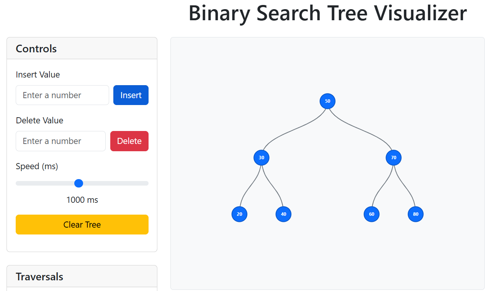
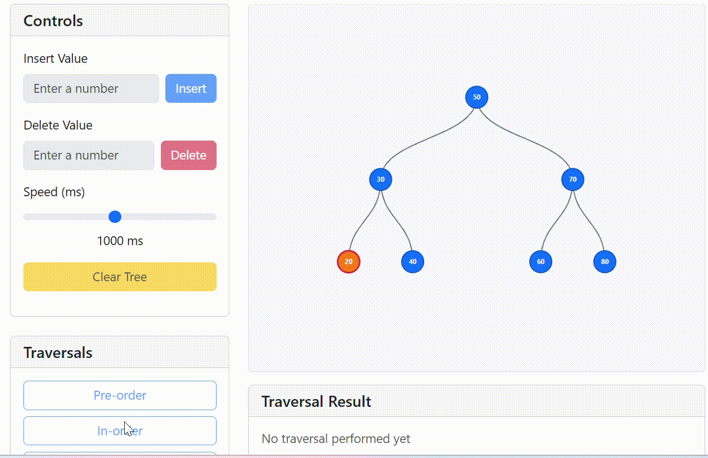
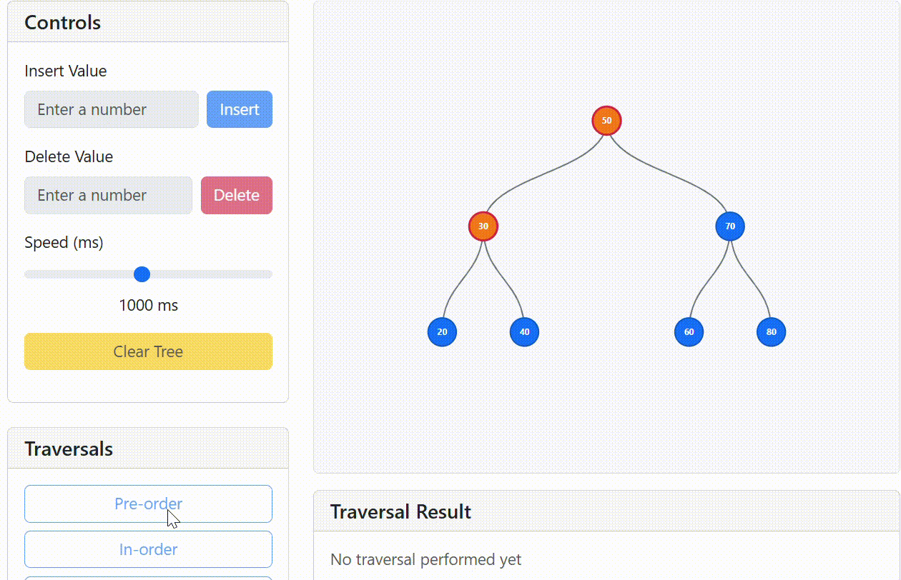

<p align="center">
  
</p>

<h2 align="center">Binary Tree Visualizer</h2>


<details>
  <summary >Table of Contents</summary>

  1. [About The Project](#about-the-project)
     - [Built With](#built-with)
  2. [Getting Started](#getting-started)
     - [Prerequisites](#prerequisites)
     - [Installation](#installation)
  3. [Usage](#usage)
  4. [Roadmap](#roadmap)
  5. [Contributing](#contributing)
  6. [License](#license)
  7. [Contact](#contact)
  8. [Acknowledgments](#acknowledgments)

</details>

###  About The Project

Visualizer is an interactive web application designed to help users visualize and understand Binary Search Trees (BSTs) in an intuitive and dynamic way.
It provides a real-time graphical representation of how nodes are inserted, deleted, and traversed within a BST, making it a valuable tool for students, educators, and anyone interested in learning data structures.
With an easy-to-use interface, users can:
- Insert new nodes into the tree.

- Delete existing nodes from the tree.

- Visualize traversal orders such as Inorder, Preorder, and Postorder.

- Reset the tree to start fresh.


#### Built With

- [](https://react.dev/)
- [](https://react.dev/)
- [](https://react-bootstrap.github.io/)
- [](https://getbootstrap.com/)
- [](https://d3js.org/)
- [](https://react-icons.github.io/react-icons/)


### Getting Started
To get a local copy up and running, follow these simple steps.

**Prequest**
Make sure you have the following installed:
- Node.js (v18 or above recommended)
- npm (comes with Node.js) or yarn

```bash
    npm create vite@latest  bootstrap d3.js react-bootstrap react-icon
```
**Installation**
1. Clone the repo
```bash
  git clone https://github.com/sinhasandeep2006/Binary-tree.git
```
2.Move to project folder
```bash
    cd bst-visualizar
```

3.Install NPM packages
```bash
  npm install
```
4.Start the development server
```bash
  npm run dev
```
### Usage
Binary Search Tree (BST) Visualizer project can be used, along with code snippets and demo descriptions:

**1.Inserting Elements in a BST**
Use Case: Visualizing the process of inserting elements into a Binary Search Tree.

Step-by-Step Process:
- Input: The user enters values to be inserted into the tree (e.g., 50, 30, 20, 40, 70, 60, 80).

- Visualization: The tree grows as nodes are added one by one.
**Code**: 
```bash
   const insert = (value) => {
    try {
      const num = parseInt(value);
      if (isNaN(num)) throw new Error("Please enter a valid number");

      setStatus(`Inserting ${num}...`);
      setError("");

      const newNode = new Node(num);

      if (!tree) {
        setTree(newNode);
        addToHistory("Insert", num, true);
      } else {
        // Clone the tree to avoid direct state mutation
        const newTree = JSON.parse(JSON.stringify(tree));
        let current = newTree;
        let path = [current.value];
        let inserted = false;

        while (!inserted) {
          if (num < current.value) {
            if (!current.left) {
              current.left = newNode;
              path.push(num);
              inserted = true;
            } else {
              current = current.left;
              path.push(current.value);
            }
          } else if (num > current.value) {
            if (!current.right) {
              current.right = newNode;
              path.push(num);
              inserted = true;
            } else {
              current = current.right;
              path.push(current.value);
            }
          } else {
            throw new Error("Value already exists in tree");
          }
        }

        setTree(newTree);
        addToHistory("Insert", path, true);
      }

      setStatus(`Successfully inserted ${num}`);
      setInputValue("");
    } catch (err) {
      setError(err.message);
      setStatus("Insert failed");
    }
  };
```

-**Demo**
<p align="center">
  
</p>

**2.Traversing a BST (In-Order Traversal)**
Use Case: Visualizing the in-order traversal of a BST to demonstrate the sorted order of elements.

Step-by-Step Process:
- In-Order Traversal visits nodes in this order: Left → Root → Right.

- Result: The nodes will be displayed in the following sequence after traversal: 20, 30, 40, 50, 60, 70, 80.

**Code:-**
```bash
    "in-order": async (node) => {
        if (node) {
          await traverseFunctions["in-order"](node.left);
          node.highlight = true;
          setTree({ ...tree });
          result.push(node.value);
          nodes.push(node);
          await new Promise((resolve) => setTimeout(resolve, speed));
          await traverseFunctions["in-order"](node.right);
          node.highlight = false;
          setTree({ ...tree });
        }
      },
```
**Demo**



**2.Traversing a BST (Pre-order Traversal)**
Use Case: Visualizing the Pre-order traversal of a BST to demonstrate the sorted order of elements.

Step-by-Step Process:
- In-Order Traversal visits nodes in this order: Root → Left → Right.

- Result: The nodes will be displayed in the following sequence after traversal: 20, 30, 40, 50, 60, 70, 80.

**Code:-**
```bash
   "pre-order": async (node) => {
        if (node) {
          node.highlight = true;
          setTree({ ...tree });
          result.push(node.value);
          nodes.push(node);
          await new Promise((resolve) => setTimeout(resolve, speed));
          await traverseFunctions["pre-order"](node.left);
          await traverseFunctions["pre-order"](node.right);
          node.highlight = false;
          setTree({ ...tree });
        }
      },
```
**Demo**



