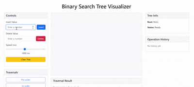
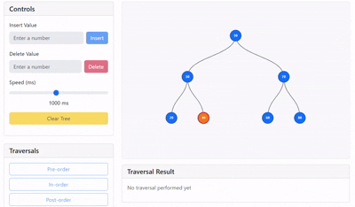

<p align="center">
  
</p>
<h2 align="center">Binary Tree Visualizer</h2>
<p align="center">
  <a href="https://visualizer-rose.vercel.app/">Demo</a>
</p>


<details>
  <summary >Table of Contents</summary>
  
  1. [Deployed Link & Working Demo](#deployed-link--working-demo)
  2. [About The Project](#about-the-project)
     - [Built With](#built-with)
  3. [Getting Started](#getting-started)
     - [Prerequisites](#prerequisites)
     - [Installation](#installation)
  4. [Usage](#usage)
  5. [Roadmap](#roadmap)
  6. [Contact](#contact)
  7. [Acknowledgments](#acknowledgments)

</details>

### Deployed Link & Working Demo
<p align="center">
  <a href="https://visualizer-rose.vercel.app/">BST Visualizer</a>
</p>
<h6 align="center">click me</h6>



###  About The Project

Visualizer is an interactive web application designed to help users visualize and understand Binary Search Trees (BSTs) in an intuitive and dynamic way.
It provides a real-time graphical representation of how nodes are inserted, deleted, and traversed within a BST, making it a valuable tool for students, educators, and anyone interested in learning data structures.
With an easy-to-use interface, users can:
- Insert new nodes into the tree.

- Delete existing nodes from the tree.

- Visualize traversal orders such as Inorder, Preorder, and Postorder.

- Reset the tree to start fresh.


#### Built With

- [](https://react.dev/)
- [](https://react.dev/)
- [](https://react-bootstrap.github.io/)
- [](https://getbootstrap.com/)
- [](https://d3js.org/)
- [](https://react-icons.github.io/react-icons/)


### Getting Started
To get a local copy up and running, follow these simple steps.

#### **Prerequisites**
Make sure you have the following installed:
- Node.js (v18 or above recommended)
- npm (comes with Node.js) or yarn

```bash
    npm create vite@latest  bootstrap d3.js react-bootstrap react-icon
```
#### **Installation**
1. Clone the repo
```bash
  git clone https://github.com/sinhasandeep2006/Binary-tree.git
```
2.Move to project folder
```bash
    cd bst-visualizar
```

3.Install NPM packages
```bash
  npm install
```
4.Start the development server
```bash
  npm run dev
```
### Usage
Binary Search Tree (BST) Visualizer project can be used, along with code snippets and demo descriptions:

##### **1.Inserting Elements in a BST**
Use Case: Visualizing the process of inserting elements into a Binary Search Tree.

Step-by-Step Process:
- Input: The user enters values to be inserted into the tree (e.g., 50, 30, 20, 40, 70, 60, 80).

- Visualization: The tree grows as nodes are added one by one.
**Code**: 
```bash
   const insert = (value) => {
    try {
      const num = parseInt(value);
      if (isNaN(num)) throw new Error("Please enter a valid number");

      setStatus(`Inserting ${num}...`);
      setError("");

      const newNode = new Node(num);

      if (!tree) {
        setTree(newNode);
        addToHistory("Insert", num, true);
      } else {
        // Clone the tree to avoid direct state mutation
        const newTree = JSON.parse(JSON.stringify(tree));
        let current = newTree;
        let path = [current.value];
        let inserted = false;

        while (!inserted) {
          if (num < current.value) {
            if (!current.left) {
              current.left = newNode;
              path.push(num);
              inserted = true;
            } else {
              current = current.left;
              path.push(current.value);
            }
          } else if (num > current.value) {
            if (!current.right) {
              current.right = newNode;
              path.push(num);
              inserted = true;
            } else {
              current = current.right;
              path.push(current.value);
            }
          } else {
            throw new Error("Value already exists in tree");
          }
        }

        setTree(newTree);
        addToHistory("Insert", path, true);
      }

      setStatus(`Successfully inserted ${num}`);
      setInputValue("");
    } catch (err) {
      setError(err.message);
      setStatus("Insert failed");
    }
  };
```

-**Demo**
<p align="center">
  
</p>

##### **2.Traversing a BST (In-Order Traversal)**
Use Case: Visualizing the in-order traversal of a BST to demonstrate the sorted order of elements.

Step-by-Step Process:
- In-Order Traversal visits nodes in this order: Left → Root → Right.

- Result: The nodes will be displayed in the following sequence after traversal: 20, 30, 40, 50, 60, 70, 80.

**Code:-**
```bash
    "in-order": async (node) => {
        if (node) {
          await traverseFunctions["in-order"](node.left);
          node.highlight = true;
          setTree({ ...tree });
          result.push(node.value);
          nodes.push(node);
          await new Promise((resolve) => setTimeout(resolve, speed));
          await traverseFunctions["in-order"](node.right);
          node.highlight = false;
          setTree({ ...tree });
        }
      },
```
**Demo**


##### **3.Traversing a BST (Pre-order Traversal)**
Use Case: Visualizing the Pre-order traversal of a BST to demonstrate the sorted order of elements.

Step-by-Step Process:
- pre-Order Traversal visits nodes in this order: Root → Left → Right.

- Result: The nodes will be displayed in the following sequence after traversal: 20, 30, 40, 50, 60, 70, 80.

**Code:-**
```bash
   "pre-order": async (node) => {
        if (node) {
          node.highlight = true;
          setTree({ ...tree });
          result.push(node.value);
          nodes.push(node);
          await new Promise((resolve) => setTimeout(resolve, speed));
          await traverseFunctions["pre-order"](node.left);
          await traverseFunctions["pre-order"](node.right);
          node.highlight = false;
          setTree({ ...tree });
        }
      },
```
**Demo**


##### **4.Traversing a BST (Post-order Traversal)**
Use Case: Visualizing the Post-order traversal of a BST to demonstrate the sorted order of elements.

Step-by-Step Process:
- post-Order Traversal visits nodes in this order: Root → Left → Right.

- Result: The nodes will be displayed in the following sequence after traversal:50,30,20,40,70,60,80.

**Code:-**
```bash
   "post-order": async (node) => {
        if (node) {
          await traverseFunctions["post-order"](node.left);
          await traverseFunctions["post-order"](node.right);
          node.highlight = true;
          setTree({ ...tree });
          result.push(node.value);
          nodes.push(node);
          await new Promise((resolve) => setTimeout(resolve, speed));
          node.highlight = false;
          setTree({ ...tree });
        }
      },
```
**Demo**



##### **5.Deleteing A Node**
- Enter the value you want to delete.

- Click the Delete button.

- If the node exists:

  - If it’s a leaf node, it gets removed.

  - If it has one child, it connects the child directly.

   - If it has two children, it replaces with the in-order successor and re-balances the tree.

The tree visually updates after deletion.

**Code:-**
```bash
    const deleteNode = (value) => {
    try {
      // Check if input is empty
      if (value === '') throw new Error('Please enter a value to delete');
      
      const num = Number(value);
      if (isNaN(num)) throw new Error('Please enter a valid number');
      if (!tree) throw new Error('Tree is empty');
  
      setStatus(`Deleting ${num}...`);
      setError('');
  
      const findMin = (node) => {
        while (node.left) {
          node = node.left;
        }
        return node;
      };
  
      const deleteRec = (node, value) => {
        if (!node) return null;
  
        if (value < node.value) {
          node.left = deleteRec(node.left, value);
        } else if (value > node.value) {
          node.right = deleteRec(node.right, value);
        } else {
          // Node found
          if (!node.left && !node.right) {
            return null;
          } else if (!node.left) {
            return node.right;
          } else if (!node.right) {
            return node.left;
          } else {
            const minRight = findMin(node.right);
            node.value = minRight.value;
            node.right = deleteRec(node.right, minRight.value);
          }
        }
        return node;
      };
  
      // Create a deep copy of the tree for immutability
      const newTree = JSON.parse(JSON.stringify(tree));
      const result = deleteRec(newTree, num);
  
      if (result === null) {
        setTree(null); // Tree is now empty
      } else {
        setTree(result);
      }
  
      setStatus(`Successfully deleted ${num}`);
      setDeleteValue(''); // Clear the delete input field
      addToHistory('Delete', num, true);
      visualizeTree();
    } catch (err) {
      setError(err.message);
      setStatus('Delete failed');
    }
  };

```
**Demo**


##### **6.Level of Order**
-  visit the nodes level by level, left to right at each level.

- while queue is not empty:

  -  Remove node from queue (say current).

  -   Visit/Print current.value.

  - If current.left exists → push it into the queue.

  - If current.right exists → push it into the queue.

✅ Repeat until queue is empty.

**Code:-**

```bash
const levelOrder = async () => {
    if (!tree) {
      setError("Tree is empty");
      return;
    }

    setIsVisualizing(true);
    setStatus("Performing level-order traversal...");
    setTraversalResult([]);

    const result = [];
    const queue = [tree];
    const nodes = [];

    while (queue.length > 0) {
      const levelSize = queue.length;
      const currentLevel = [];

      for (let i = 0; i < levelSize; i++) {
        const currentNode = queue.shift();
        currentNode.highlight = true;
        setTree({ ...tree });
        currentLevel.push(currentNode.value);
        nodes.push(currentNode);
        result.push(currentNode.value);
        await new Promise((resolve) => setTimeout(resolve, speed));

        if (currentNode.left) queue.push(currentNode.left);
        if (currentNode.right) queue.push(currentNode.right);

        // Reset highlight after processing children
        currentNode.highlight = false;
        setTree({ ...tree });
      }
    }

    setTraversalResult(result);
    setStatus("Completed level-order traversal");
    setIsVisualizing(false);
    addToHistory("Traversal", "Level-order");
  };
```
**Demo**


##### **7.Clear Tree**
- Click the Clear Tree button.

- It resets the visualizer — removes all nodes and clears the history.

  - Useful when you want to start fresh.

##### **8.History Tracking**
- Every action (Insert, Search, Delete) is recorded in the History panel.

- You can see a step-by-step log of what operations you performed.

- Helpful for learning and debugging your operations on the tree.

## Roadmap
Here’s the development plan and upcoming features for the Binary Search Tree Visualizer:

 **Completed**
 - [X] Insert nodes into the Binary Search Tree
 - [X] Search for a specific node with path visualization
 - [X] Delete nodes (leaf, one child, two children)
 - [X] In-Order Traversal visualization
 - [X] Pre-Order Traversal visualization
 - [X] Post-Order Traversal visualization
 - [X] Level-Order Traversal (BFS) visualization
 - [X] Operation History (Insert/Delete/Search tracking)
 - [X] Reset Tree functionality
 - [X] Error handling with user-friendly messages
 - [X] Responsive UI for Desktop and Mobile

🛠️ **In Progress**
 - [ ] Improve animations (smooth transitions during insert and delete)
 - [ ] Add dark mode toggle 🌑🌕

🚀 **Future Plans**
 - [ ] Add AVL Tree visualizer (Self-Balancing BST)
- [ ]  Save/Load Tree structure from local storage

## Contact
**Sandeep sinha**- **@avtadell** - **1233sandeepsinha@gmail.com**

### Acknowledgments

I would like to thank the following resources and individuals who helped in building this project:

- [GeeksforGeeks](https://www.geeksforgeeks.org/) — for understanding BST algorithms and traversal techniques.
- [FreeCodeCamp](https://www.freecodecamp.org/) — for great articles on Data Structures.
- [YouTube Tutorials](https://www.youtube.com/) — for visual inspiration on tree animations.
- [React Documentation](https://react.dev/) — for guidance on building interactive UIs.
- Special thanks to friends and mentors for continuous support and feedback. 🚀

---
